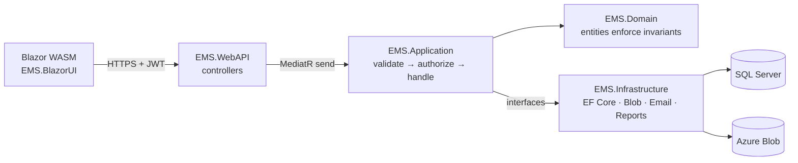
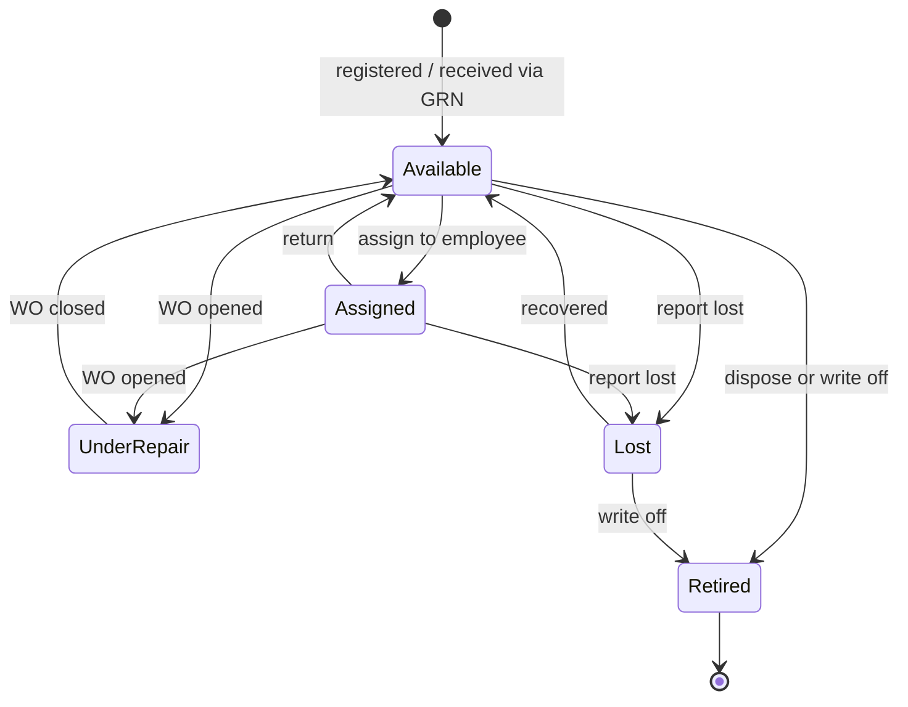
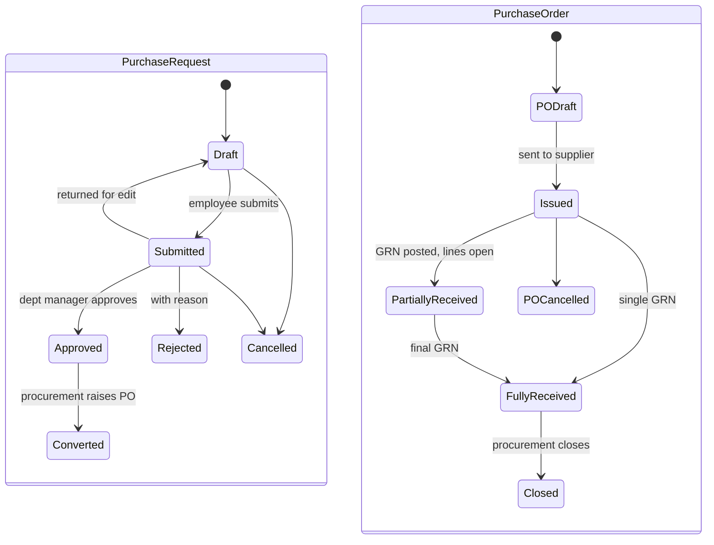
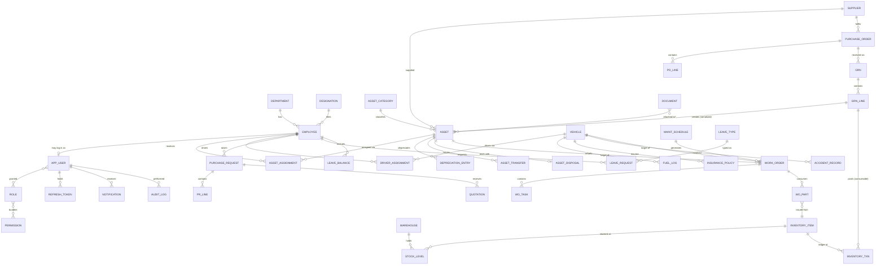
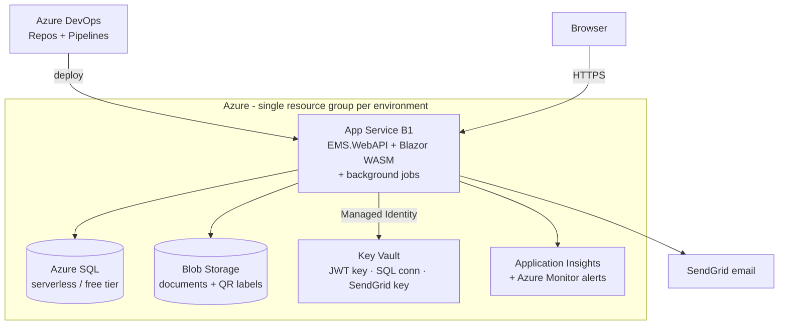

# Enterprise Management System (EMS)
## System Design Document

| Field | Value |
|---|---|
| Document ID | EMS-SDD-001 |
| Version | 1.0 |
| Status | Baseline for Phase 1 (Requirements Specification) |
| Date | 2026-07-08 |
| Author | gitatarobert6@gmail.com |
| SDLC Phase | Master design — input to Phase 1 (SRS) and Phase 2 (detailed ERD) |

### Revision history
| Ver | Date | Change |
|---|---|---|
| 0.1 | 2026-07-08 | Initial EAMS draft (asset-management-only scope, stack-agnostic) |
| 0.2 | 2026-07-08 | Self-critique revision (13 logical gaps resolved) |
| **1.0** | 2026-07-08 | **Pivot to EMS per product-owner specification**: scope expanded to mini-ERP (11 modules); stack fixed to ASP.NET Core / Blazor / SQL Server / EF Core / Azure / DevExpress / Azure DevOps; external-ERP integration removed (EMS is itself the system of record); IoT ingestion and PostgreSQL/TimescaleDB decisions superseded |

---

# Specification Review — Gaps Filled by This Design

Continuing the self-review discipline from v0.2: the product specification (module list, stack,
phase plan) is the authority on **what** to build, but it leaves engineering questions open.
Each gap below is stated as *Gap → Resolution section*. These are design decisions, not scope
changes — flag any you disagree with during review.

| # | Gap in specification | Resolution |
|---|---|---|
| G-1 | No non-functional requirements at all (performance, availability, retention) | §4.2 quantifies them at portfolio-realistic scale |
| G-2 | Workflows named (procurement, leave, maintenance) but no states, transitions, or rules — the data model and APIs cannot be designed without them | §6 defines every state machine |
| G-3 | No concurrency handling — two managers approving the same request, two clerks issuing the last stock unit | §7.3: rowversion optimistic concurrency + transactional stock rules |
| G-4 | Depreciation listed as a feature with no method, trigger, or authority defined; there is no external ERP in this system, so EMS itself must be the financial record | §6.3: straight-line + declining-balance, monthly posting job, financial-year aware |
| G-5 | Maintenance appears three times (Asset "Maintenance History", Fleet "Service Scheduling", Module 7) with overlapping responsibility | §6.7: one Maintenance module owns all work orders; Asset and Fleet screens are filtered views into it |
| G-6 | Asset vs. Inventory boundary is contradictory — laptops and chairs appear as both assets and consumables | §6.4: serialized/individually-tracked items are Assets; bulk consumables are Inventory; the receiving step of procurement decides which is created |
| G-7 | No testing strategy — indefensible for a project meant to demonstrate engineering maturity | §15 |
| G-8 | No demo/seed-data plan — a portfolio system that opens onto empty tables fails its primary purpose (recruiters must see a living system) | §16: seeded fictional company with 2 years of history |
| G-9 | "JWT + RBAC" named without token lifetimes, refresh rotation, or how permissions are enforced | §9 |
| G-10 | No Azure cost model — this is self-funded; an accidentally provisioned Premium tier matters | §12.3: ~free-to-$25/month target |
| G-11 | No data conventions (audit columns, soft delete, keys) | §7.2 |
| G-12 | DevExpress is commercial (~$900+/yr for Reporting); licensing unacknowledged | Risk R-1 with open-source fallback |
| G-13 | Leave balances mentioned with no accrual, carry-over, or overlap rules | §6.8 |
| G-14 | Blazor hosting model unspecified — Server vs. WebAssembly changes the entire auth design | Decision D-2: Blazor WebAssembly + Web API |

---

## 1. Introduction

### 1.1 Purpose
EMS is a modular mini-ERP for a mid-size organization: employees, assets, inventory, fleet,
procurement, maintenance, and leave, with reporting, notifications, and full RBAC. It has a
dual purpose, and both drive design decisions:

1. **Product:** a realistic internal system of the kind mid-size organizations run.
2. **Portfolio:** a flagship demonstration of enterprise .NET engineering — Clean
   Architecture, SOLID, secure auth, complex workflows, reporting, Azure deployment, CI/CD —
   targeted at US/UK remote software developer roles. Where product and portfolio goals
   conflict (e.g., big-data scale vs. demonstrable patterns), portfolio wins.

### 1.2 Scope
**In scope** — the 11 modules from the specification: Dashboard, Authentication & Security,
Employee Management, Asset Management, Inventory Management, Fleet Management, Procurement,
Maintenance, Leave Management, Reports, Notifications, plus Administration.

**Deferred (future enhancements, per specification):** MFA, GPS/telematics integration,
AI demand forecasting, OCR invoice scanning, Power BI, Entra ID federation, SignalR real-time
push, .NET MAUI mobile app. The design leaves seams for each (noted in-line).

### 1.3 Fixed technology decisions (from specification — not revisited here)
ASP.NET Core Web API · Blazor front end · SQL Server + EF Core (code-first) · Clean
Architecture · JWT/OAuth with RBAC · DevExpress Reporting · Azure (App Service, Azure SQL,
Blob Storage, Key Vault, Monitor + Application Insights) · Azure DevOps Pipelines.

### 1.4 Design assumptions
- **A-1 Scale:** design target 1,000 employees, 10,000 assets, 200 vehicles, 50 concurrent
  users; demo seed at ~1/10 of that. All NFRs (§4.2) derive from these figures.
- **A-2 Team:** one developer (the author); design favors one deployable, minimal moving parts.
- **A-3 Budget:** Azure spend near-free for dev, ≤ ~$25/month for a always-on demo (§12.3).
- **A-4 .NET version:** .NET 10 (current LTS). Fall back to .NET 8 LTS only if a dependency
  (DevExpress Blazor) lags — verify in Sprint 0.
- **A-5 Single company, multi-department.** No multi-tenancy; `DepartmentId` is the main
  organizational scoping unit for authorization (§9.2).

---

## 2. Goals and Success Criteria

**Product outcomes:** every module workflow completable end-to-end; procurement flows from
request to received goods to a created asset or stock; leave and maintenance fully
approvable; all seven specified reports exportable to PDF/Excel/CSV.

**Portfolio outcomes (the CV claims this project must substantiate):**
| Claim | Evidence in this system |
|---|---|
| Clean Architecture & SOLID | §5 solution structure; dependency rule enforced by project references + architecture tests |
| Secure authentication | Identity + JWT + rotating refresh tokens + permission policies (§9) |
| Complex business workflows | Procurement (§6.6), Leave (§6.8), Maintenance (§6.7) state machines |
| Enterprise data modeling | §7: 30+ entity model, audit, soft delete, concurrency |
| Reporting | DevExpress report suite with exports (§10) |
| Cloud engineering | Azure architecture (§12) with Key Vault, Blob, App Insights |
| CI/CD | Multi-stage Azure DevOps YAML pipeline with tests and EF migrations (§13) |
| Testing discipline | Unit + integration + component tests as pipeline gates (§15) |

A recruiter-facing README, architecture diagram, and 3-minute demo script are deliverables of
Phase 6, not afterthoughts.

---

## 3. Roles and Personas

From the specification: **Super Admin, HR, Procurement Officer, Fleet Manager, Department
Manager, Employee.** Two additions recommended (the workflows in §6 need them; confirm in
Phase 1): **Maintenance Technician** (executes work orders) and **Store Keeper** (stock
in/out, GRN receiving). Full role → permission matrix in Appendix A.

Every user is (optionally) linked to an Employee record; Employee is the person, User is the
login. This separation lets HR manage staff who never log in.

---

## 4. Requirements Summary

### 4.1 Functional requirements (design-driving; SRS elaborates in Phase 1)
| ID | Requirement |
|---|---|
| FR-01 | Authentication: login, logout, forgot/reset password (email token), JWT access + refresh rotation; account lockout on repeated failure |
| FR-02 | Authorization: roles bundle fine-grained permissions; permission checks enforced server-side on every endpoint; department-scoped visibility for manager roles |
| FR-03 | Employee CRUD with department, designation, employment status, documents (Blob), emergency contacts |
| FR-04 | Asset register: category taxonomy, supplier, purchase & warranty details, QR/barcode label, status per §6.2, assignment/transfer/disposal with dated history |
| FR-05 | Monthly depreciation posting per asset (straight-line or declining balance per category), depreciation report by financial year |
| FR-06 | Inventory: item catalog, per-warehouse stock, stock-in/out with reasons, minimum-stock alerts, full transaction ledger |
| FR-07 | Fleet: vehicle register, driver assignment history, fuel logs with odometer validation, insurance policies with expiry alerts, accident records, service scheduling via Maintenance module |
| FR-08 | Procurement: PR → approval → PO → GRN workflow per §6.6; receiving creates Assets (serialized) or stock (consumables) |
| FR-09 | Maintenance: work orders against assets or vehicles, technician assignment, parts consumption from inventory, costs, schedules (date- or mileage-based), calendar view |
| FR-10 | Leave: types, balances with accrual and carry-over rules, request/approval workflow, overlap validation, team calendar |
| FR-11 | Reports: the 7 specified reports (assets by department, fleet costs, employee list, procurement summary, maintenance costs, inventory levels, depreciation), exportable PDF/XLSX/CSV |
| FR-12 | Notifications: in-app + email for assignments, approvals/rejections, low stock, warranty & insurance expiry, upcoming maintenance |
| FR-13 | Administration: departments, designations, company profile, financial year, leave types, categories, role/permission management, system settings |
| FR-14 | Audit: every create/update/delete/state-transition recorded (who, what, when, before/after); viewable by Super Admin |
| FR-15 | Dashboard: KPI tiles and charts per role (assets by status, pending approvals, fleet cost trend, leave today, low stock) |

### 4.2 Non-functional requirements (quantified — fills G-1)
| ID | Requirement | Target |
|---|---|---|
| NFR-01 | Interactive API latency | p95 ≤ 500 ms at 50 concurrent users on the §12.3 tiers |
| NFR-02 | Blazor first load | ≤ 4 s cold (WASM download, compressed + trimmed), ≤ 1.5 s warm |
| NFR-03 | Availability | 99% monthly for the demo deployment (single region, no HA SQL — accepted cost trade-off, documented) |
| NFR-04 | Recovery | Azure SQL PITR: RPO ≤ 10 min, retention 7 days; RTO ≤ 4 h (redeploy from pipeline + restore) |
| NFR-05 | Data retention | Audit logs and financial records kept for the life of the system; soft-deleted rows never purged in R1 |
| NFR-06 | Security | OWASP ASVS L1 verified + L2 for auth/session chapters; TLS-only; secrets exclusively in Key Vault; no PII in logs |
| NFR-07 | Report generation | ≤ 10 s for any specified report at A-1 volumes |
| NFR-08 | Accessibility & UX | WCAG 2.1 AA intent for the Blazor UI; responsive to tablet width |
| NFR-09 | Auditability | 100% of state transitions and financial postings traceable to a user and timestamp |

---

## 5. Architecture

### 5.1 Style
**Clean Architecture, single deployable** (fills A-2): one Web API host serving the Blazor
WebAssembly client's static files, one SQL Server database, background jobs in-process. No
message broker, no microservices — at A-1 scale they would be résumé-driven complexity; the
portfolio value is in the *discipline of the layering*, which is enforced mechanically (§5.3).

### 5.2 Solution structure
```
EMS.sln
├── src/
│   ├── EMS.Domain            Entities, enums, domain events, business rules,
│   │                         repository interfaces. Zero external dependencies.
│   ├── EMS.Application       Use cases: MediatR commands/queries + handlers,
│   │                         FluentValidation validators, DTO mapping,
│   │                         abstraction interfaces (IEmailSender, IFileStore,
│   │                         IDateTime, ICurrentUser). Depends only on Domain.
│   ├── EMS.Infrastructure    EF Core DbContext + configurations + migrations,
│   │                         Identity, repositories, Blob storage, SMTP/SendGrid,
│   │                         DevExpress report implementations, background jobs.
│   │                         Depends on Application (implements its interfaces).
│   ├── EMS.WebAPI            Controllers, auth pipeline, middleware (exception →
│   │                         ProblemDetails, request logging), Swagger, DI
│   │                         composition root. Serves the Blazor WASM bundle.
│   ├── EMS.BlazorUI          Blazor WebAssembly client (pages, components,
│   │                         typed API clients, auth state provider).
│   └── EMS.Shared            Request/response contracts + enums shared by
│                             WebAPI and BlazorUI (single source of truth).
└── tests/
    ├── EMS.Architecture.Tests   NetArchTest rules: layer dependencies (§5.3)
    ├── EMS.Domain.Tests         Pure unit tests of entities/rules
    ├── EMS.Application.Tests    Handler tests with mocked interfaces
    ├── EMS.IntegrationTests     WebApplicationFactory + real SQL (§15)
    └── EMS.UI.Tests             bUnit component tests
```

### 5.3 Dependency rule and request flow

Dependencies point inward only: `Domain ← Application ← Infrastructure/WebAPI`. The
`EMS.Architecture.Tests` project fails the build if, e.g., Domain references EF Core or a
controller references DbContext — the layering claim on the CV is thereby *tested*, not
asserted.

**Request pipeline (every mutation):** controller → MediatR → pipeline behaviors in order:
logging → FluentValidation → permission check (`ICurrentUser` claims) → transaction →
handler → domain events dispatched on `SaveChanges` → response DTO. Cross-cutting concerns
live once, in behaviors, not in 40 handlers.

### 5.4 Patterns used (and deliberately not used)
- **Used:** CQRS-lite (separate command/query handlers, one database), repository interfaces
  per aggregate root (Domain-owned), EF Core `DbContext` as the Unit of Work (no redundant
  UoW wrapper — interview-defensible: EF already implements it), domain events via MediatR
  notifications (e.g., `LeaveApproved` → notification handler), specification pattern for
  reusable query filters.
- **Not used, with reasons documented for interviews:** generic `IRepository<T>` (hides EF,
  encourages leaky IQueryable), AutoMapper in Domain (manual mapping in Application — explicit
  and debuggable), event sourcing (unjustified complexity at this scale).

### 5.5 Background processing
A single `BackgroundService` host in WebAPI runs scheduled jobs sequentially (fills the
specification's silent need for *something* to fire time-based behavior):
| Job | Schedule | Action |
|---|---|---|
| Depreciation posting | Monthly, 1st 02:00 | §6.3 postings for the closed month |
| Maintenance due scan | Daily 05:00 | Generate WOs from schedules (date/mileage due) |
| Expiry scan | Daily 06:00 | Warranty, insurance, document expiry → notifications |
| Low-stock scan | Hourly | `available < minimum` → notify Store Keeper/Procurement |
| Leave accrual | Monthly, 1st 03:00 | Accrue balances per leave-type policy |
Jobs are idempotent (natural keys / period stamps) so a missed or double run is harmless.
Seam: swap to Hangfire or Azure Functions later without touching job logic (jobs are
Application-layer use cases invoked by the scheduler).

---

## 6. Module Design

### 6.1 Dashboard
Role-aware landing page: KPI tiles (assets by status, open WOs, pending approvals for *me*,
low-stock count, on-leave today, month fleet cost) + trend charts. All data from dedicated
aggregate query endpoints (no client-side joining), cached 60 s.

### 6.2 Asset Management
- Register: code (auto, per category prefix), name, category (tree), serial, supplier,
  purchase date/cost, warranty end, department, custom notes, photos/documents (Blob).
- QR/barcode: server generates a QR PNG encoding the asset code; printable label page.
  (Seam: future MAUI app scans it.)
- **Status machine (from specification):**

  Transitions are commands with server-side validation; each writes an `AssetAssignment` /
  `AssetTransfer` / `AssetDisposal` history row and an audit event. `Retired` is terminal.
- Assignment: to an employee (accountability) with optional condition notes both directions.
  Transfer: department-to-department with approval by receiving Department Manager.
- Maintenance history tab = filtered view of Maintenance module WOs for this asset (G-5).

### 6.3 Depreciation (fills G-4)
- EMS is the system of record for asset book value (there is no external ERP in this product).
  It is an asset register, not a general ledger — no double-entry accounting is attempted.
- Method per **category**: straight-line (default) or declining balance; parameters: useful
  life (months), residual %. Asset can override category defaults.
- Monthly job (§5.5) posts one immutable `DepreciationEntry` per active asset per month within
  the configured Financial Year (§6.11); book value = cost − Σ entries, floored at residual.
  Disposal before end-of-life posts a final entry and records gain/loss vs. proceeds.
- Entries are never edited — corrections post reversing entries (auditability, NFR-09).

### 6.4 Inventory Management (boundary fixed per G-6)
- **Rule:** individually tracked, serialized items (a laptop, a vehicle) = **Asset**. Bulk
  consumables (toner, chargers, cables, chairs bought in quantity) = **Inventory item**. The
  GRN line (§6.6) carries an `ItemNature` flag — set at PR time, confirmed at receiving —
  which routes creation to one module or the other. This one rule removes the specification's
  ambiguity everywhere downstream.
- Item catalog (code, name, category, unit, min level per warehouse), multi-warehouse stock.
- Every movement is an append-only `InventoryTransaction` (type: StockIn, StockOut,
  Adjustment, MaintenanceIssue, GrnReceipt; quantity; reason; reference to WO/GRN). On-hand
  is a maintained balance validated nightly against the transaction sum.
- Stock-out for maintenance links the transaction to the work order (cost flows to §6.7).
- Concurrency: stock decrement uses an atomic conditional `UPDATE … WHERE Quantity >= @qty`
  — never read-then-write (G-3).

### 6.5 Fleet Management
- Vehicle register: plate, VIN, make/model/year, department, status (mirrors asset statuses),
  photos/documents.
- Driver assignment: dated history linking Vehicle ↔ Employee; one active driver per vehicle.
- Fuel logs: date, litres, cost, odometer — odometer must be ≥ last reading (monotonic
  validation; flag rather than reject if a correction reason is given).
- Insurance policies: insurer, policy number, premium, start/end → expiry-scan notifications.
- Accident records: date, driver, description, cost, documents, optional link to a repair WO.
- Service scheduling and repairs = Maintenance module schedules/WOs with `TargetType =
  Vehicle` (G-5); mileage-based schedules read latest odometer from fuel logs.
- Reports feed: cost/km = (fuel + maintenance + insurance amortized) ÷ odometer delta per
  period — formula fixed here so DevExpress and dashboard agree (single-source KPI lesson
  carried over from v0.2).

### 6.6 Procurement (specification workflow, made precise)

- PR: lines (item description or catalog ref, qty, `ItemNature`, est. cost, justification);
  approval routes to the requester's Department Manager; above a configurable amount, a
  second approval by Procurement Officer (two-level approval — worth demonstrating).
- Quotations: attach supplier quotes to an approved PR; selecting one seeds the PO.
- PO: supplier, lines with agreed prices, expected date; issued PDF via DevExpress.
- **GRN (the integration moment):** received qty per line (partial allowed); each received
  line **creates Assets (one per unit, status Available, purchase details prefilled) or posts
  an Inventory StockIn** per `ItemNature`. This PR→PO→GRN→Asset/Stock thread is the system's
  showcase workflow — the demo script (§16) walks it end-to-end.
- Approval concurrency: state transitions guard on rowversion — two simultaneous approvals of
  one PR: first wins, second gets a 409 (G-3).

### 6.7 Maintenance (one module for assets and vehicles — G-5)
- **Work order:** number, target (`Asset` or `Vehicle` — exactly one FK set, DB check
  constraint), type (Repair/Preventive/Inspection), priority, problem description, technician
  assignment, task checklist, parts issued (from Inventory, §6.4), labor hours × rate,
  external cost, completion notes.
- States: `Requested → Approved → Scheduled → InProgress → Completed → Closed`, with
  `OnHold` (from InProgress, reason required) and `Cancelled` (any pre-Completed state;
  releases nothing to inventory that wasn't issued). Approval skipped under a cost threshold.
  Opening a WO sets the target's status to `UnderRepair`; closing restores it.
- **Schedules:** per asset/vehicle: every N days and/or every N km (vehicles). Daily job
  generates WOs when due (idempotent on schedule+due-date natural key), with lead time.
- Calendar view: scheduled + open WOs by week/month, filterable by technician/department.
- Cost rollup: WO total posts to the asset/vehicle cost history on Close (feeds reports).

### 6.8 Leave Management (rules fixed per G-13)
- Leave types (Annual, Sick, Unpaid, …): annual entitlement days, accrual mode (monthly
  pro-rata or lump on Jan 1 / hire anniversary), max carry-over days, requires-attachment
  flag (e.g., sick note → Blob).
- Balance ledger per employee/type/year: entitlement + accrued + carry-over − taken −
  pending. Displayed everywhere as `available = balance − pending` so double-booking is
  visible immediately.
- Request: date range (working days computed against a holiday calendar — admin-maintained),
  half-day flags, reason. **Validation:** sufficient available balance, no overlap with own
  approved/pending leave.
- Workflow: `Draft → Submitted → Approved | Rejected`; `Approved → Cancelled` allowed until
  start date (restores balance). Approver = Department Manager (HR can act on any). Balance
  is *reserved* on submit (counts in pending) and *deducted* on approval — revalidated at
  approval time in the same transaction (G-3).
- Team calendar: month grid of approved leave for the manager's department.

### 6.9 Reports (DevExpress)
Seven specified reports, all parameterized (date range, department, category as applicable),
all exportable to PDF/XLSX/CSV: Assets by Department · Fleet Costs · Employee List ·
Procurement Summary · Maintenance Costs · Inventory Levels · Depreciation (by financial year).
Design in §10.

### 6.10 Notifications
- `Notification` entity: recipient user, type, title, body, link (deep link into the UI),
  read flag. Raised two ways: **domain events** (leave approved, WO assigned, PR needs your
  approval, transfer awaiting acceptance) and **scheduled scans** (§5.5: low stock, warranty/
  insurance expiry, maintenance due).
- Delivery: in-app (bell menu; client polls every 60 s — SignalR is the documented future
  seam) + email for approval-required and expiry classes, via `IEmailSender`
  (SendGrid free tier or SMTP; provider behind the interface). Email failures retry ×3 then
  log — never block the business transaction.
- Per-user preference matrix (notification class × channel) in profile settings.

### 6.11 Administration
Company profile (name, logo → report headers), departments & designations, financial year
definition (locks depreciation periods once closed), leave types & holiday calendar, asset/
inventory categories, suppliers, role & permission management (§9), system settings
(approval thresholds, auto-numbering formats), audit log viewer (filter by user/entity/date),
system health page (job last-run status).

---

## 7. Data Architecture

### 7.1 Entity map (detailed column-level ERD is the Phase 2 deliverable)

(*`DOCUMENT` is polymorphic — owner type + id — attaching to assets, employees, vehicles,
GRNs, accidents, leave requests; the file itself lives in Blob Storage, the row holds
metadata + blob path.)

### 7.2 Conventions (fills G-11)
- **Keys:** `int` identity PKs throughout (simple, index-friendly at this scale); business
  keys (asset code, PO number, employee number) as unique-constrained columns with
  configurable auto-number formats.
- **Audit columns** on every table: `CreatedAtUtc, CreatedBy, ModifiedAtUtc, ModifiedBy` —
  populated by an EF `SaveChangesInterceptor` from `ICurrentUser`; plus full before/after
  JSON snapshots to `AuditLog` for business entities (FR-14).
- **Soft delete:** `IsDeleted` + EF global query filter on master data; ledger tables
  (`InventoryTransaction`, `DepreciationEntry`, `AuditLog`, `FuelLog`) are append-only and
  never deleted.
- **Concurrency:** `rowversion` on every mutable entity; API returns 409 with a
  ProblemDetails payload the Blazor UI turns into a "reload and retry" prompt (G-3).
- **Enums** stored as `tinyint` with EF value conversion; enum types live in `EMS.Shared`
  so client and server share definitions.
- **Money** as `decimal(18,2)`; single currency in R1 (admin setting); dates in UTC,
  date-only fields (leave dates) as `date`.
- **Migrations:** EF code-first, committed per feature; deployed as an idempotent SQL script
  in the pipeline (§13) — never runtime `Migrate()` in production.

### 7.3 Transactional rules (G-3 summary)
Stock changes are conditional atomic updates; approvals guard on rowversion; balance
deduction happens inside the approval transaction; GRN posting (receive + create assets +
stock-in + PO status) is one transaction. Single database = real ACID everywhere — a
deliberately defensible simplification vs. v0.2's outbox (which becomes relevant only if the
system is ever split; noted as the extraction seam).

---

## 8. API Design

- REST + JSON, `/api/v1/…`, OpenAPI (Swagger UI in dev/staging; the generated spec also
  drives a typed client for `EMS.BlazorUI` via NSwag/Kiota — no hand-written fetch code).
- Conventions: paged list responses (`items, page, pageSize, totalCount`), filter/sort query
  parameters, RFC 7807 ProblemDetails for all errors (validation errors keyed by field for
  Blazor form display), `ETag`/rowversion on mutable resources, idempotency via natural
  command design (approve twice → second gets 409/no-op).
- **Workflow transitions are verb endpoints** (`POST /purchase-requests/{id}/approve`,
  `/work-orders/{id}/complete`, `/leave-requests/{id}/cancel`) — never status PATCHes; the
  server state machines in §6 are the only authority.
- File upload/download: API issues short-lived SAS URLs for Blob (client uploads directly —
  keeps large files off the App Service).
- Rate limiting: ASP.NET Core rate limiter, per-user token bucket on auth endpoints
  (brute-force guard) and a global sane default.

---

## 9. Security Architecture (fills G-9)

### 9.1 Authentication
- **ASP.NET Core Identity** on SQL Server (users, password hashing, lockout, email
  confirmation, reset tokens).
- **JWT access tokens, 15-min lifetime**, signed HS256 with a Key Vault secret (RS256 if
  federation ever added — seam). Claims: user id, employee id, department id, roles,
  permissions (compact custom claim).
- **Refresh tokens: 7-day, rotating, one-time-use**, stored hashed in `RefreshToken` with
  device info; reuse of a consumed token revokes the whole family (theft detection).
  Blazor WASM stores the access token in memory and the refresh token in a secure,
  `HttpOnly`-cookie-backed endpoint pattern; tokens never touch `localStorage`.
- Forgot password: Identity email token → reset page; lockout: 5 failures / 15 min.
- MFA (TOTP via Identity) is a documented future toggle, not in R1 (per specification).

### 9.2 Authorization
- **Permissions are the unit of enforcement** (`Assets.Create`, `Leave.Approve`,
  `Procurement.ApproveL2`, … full list Appendix A); roles are named bundles editable by
  Super Admin; seeded defaults per §3.
- Custom `IAuthorizationPolicyProvider` + `[HasPermission(…)]` attribute → policy per
  permission; checked in the MediatR authorization behavior too (defense in depth — API
  surface and use-case layer).
- **Scoping:** Department Managers see their department's employees/assets/requests
  (repository-level filter injected from claims); HR/Procurement/Fleet roles are org-wide
  within their module; employees see self + assigned items. Blazor hides what the API
  forbids, but the API is the enforcement point — UI hiding is UX, not security.
- Segregation of duties: a PR's requester cannot approve it; a WO's technician cannot be its
  closer's approver.

### 9.3 Platform security
TLS-only (HSTS); secrets exclusively in Key Vault via Managed Identity (zero credentials in
config/pipeline); SQL access via Managed Identity where supported; EF parameterization
everywhere (no raw SQL without parameters); upload validation (extension + content-type +
size cap; Blob container private, SAS-only); security headers middleware (CSP, X-Frame-Options,
etc.); dependency scanning (`dotnet list package --vulnerable` + Dependabot/NuGet audit in CI);
audit log per FR-14; no PII in logs or App Insights (telemetry processor scrubs).

---

## 10. Reporting Design (DevExpress)

- **XtraReport** definitions live in Infrastructure (one class per report), bound to
  read-only EF queries (`AsNoTracking`, projection DTOs) — reports never touch tracked
  aggregates.
- **DevExpress Blazor Report Viewer** hosted in a Reports area of the UI; parameters panel
  (date range, department, category) generated per report; export PDF/XLSX/CSV via DevExpress
  exporters, server-side, streamed.
- Company profile (logo, name, FY) injected into report headers from Administration.
- Scheduled email of reports = future enhancement (job seam exists in §5.5).
- **Licensing (Risk R-1):** DevExpress Reporting requires a paid license (~$900+/yr). Options:
  30-day trial for the build phase, academic/startup discounts, or the documented fallback —
  QuestPDF (PDF) + ClosedXML (XLSX) behind the same `IReportService` interface, keeping the
  seven reports identical in content. The interface exists from day one so the decision is
  swappable; the CV line then reads "pluggable reporting engine (DevExpress / open-source)".

---

## 11. Blazor UI Design

- **Hosting model (D-2):** Blazor **WebAssembly**, served from the WebAPI App Service. Chosen
  over Server because: matches the specification's `Blazor → Web API` diagram, exercises the
  JWT flow honestly (Server would hide it in a circuit), free of per-user circuit memory on
  the single cheap App Service, and survives connection blips. Trade-off accepted: initial
  download (mitigated: trimming, compression, lazy-loaded module assemblies — NFR-02).
- Component library: **MudBlazor** (free, mature) for the app shell, grids, forms; DevExpress
  Blazor components only where the license is already required (report viewer). Keeps the
  license surface minimal.
- Structure: feature folders mirroring modules; typed API clients from OpenAPI (§8);
  `AuthenticationStateProvider` wired to the token service; permission-aware `<Authorized>`
  wrappers around nav items and action buttons; shared form components (validated inputs
  bound to ProblemDetails field errors); toast + confirm-dialog services.
- State: lightweight per-feature stores (scoped services); no Redux-style framework —
  documented as a deliberate simplicity decision.

---

## 12. Azure Architecture

### 12.1 Topology


### 12.2 Environments
- **dev:** local — SQL Server LocalDB/Developer Edition, Azurite for Blob, user-secrets.
- **staging:** deployment slot on the App Service (free with B1+) — pipeline target, smoke
  tests, then slot-swap to production. One SQL database with a `staging` copy only during
  release verification (cost control).
- **prod (demo):** the swapped slot; custom domain + managed certificate.

### 12.3 Cost model (fills G-10)
| Resource | Tier | ~$/month |
|---|---|---|
| App Service | B1 (Linux) | ~13 |
| Azure SQL | Serverless auto-pause or the free-tier offer (100k vCore-s) | 0–5 |
| Blob Storage | LRS, <5 GB | <1 |
| Key Vault | Standard, low ops | <1 |
| App Insights | Sampling on, 1 GB cap | 0 (free grant) |
| Azure DevOps | Free tier (1 parallel job, 5 users) | 0 |
| **Total** | | **~$15–20** |
Budget alert at $30 on the subscription. Dev is $0 (all-local). If the demo need not be
always-on, App Service F1 brings it near $0 with documented cold-start caveats.

---

## 13. CI/CD — Azure DevOps

Multi-stage YAML pipeline (`azure-pipelines.yml`, in-repo):
1. **Build & test:** restore → build (warnings as errors) → unit + architecture + bUnit
   tests → integration tests against a SQL container service → coverage published (target
   ≥ 70% on Domain + Application) → NuGet vulnerability audit.
2. **Package:** publish WebAPI (with WASM assets) → pipeline artifact; generate **idempotent
   EF migration script** (`dotnet ef migrations script --idempotent`) → artifact.
3. **Deploy staging:** run migration script against Azure SQL (pipeline service connection) →
   deploy artifact to the staging slot → smoke test (health endpoint + login round-trip).
4. **Deploy production:** manual approval gate → slot swap → post-swap smoke test.
   Rollback = swap back (schema stays compatible: expand-contract migration rule — additive
   first, destructive only one release later).
Branch policy: PR builds run stage 1; `main` is protected; releases tag semver.
Infrastructure: Bicep templates in-repo, applied by a separate infra pipeline (showcase IaC
without Terraform overhead on a one-person project).

---

## 14. Observability

- **Serilog** structured logging → console (dev) + Application Insights (cloud); request logs
  with correlation IDs flowing from Blazor (HTTP header) through MediatR behaviors to SQL.
- App Insights: request/dependency telemetry, exception tracking, availability ping on
  `/health` (5-min web test), custom events for business milestones (PR approved, WO closed —
  makes the demo's App Insights dashboard tell a business story, not just HTTP codes).
- `/health` endpoint: SQL, Blob, Key Vault checks (`AspNetCore.HealthChecks.*`).
- Azure Monitor alerts: availability < 99%, exceptions spike, budget threshold, job-failure
  custom metric (§5.5 jobs report success/failure).

---

## 15. Testing Strategy (fills G-7)

| Layer | Tooling | What is tested | Gate |
|---|---|---|---|
| Architecture | NetArchTest | Layer dependency rules (§5.3) | PR |
| Domain unit | xUnit + FluentAssertions | State machines (§6 transitions incl. illegal ones), depreciation math, leave balance rules, odometer/stock validations | PR |
| Application unit | xUnit + NSubstitute | Handlers: authorization behavior, validation, event dispatch | PR |
| Integration | WebApplicationFactory + MSSQL Testcontainer | Full HTTP → SQL: auth flows (login/refresh/rotation/reuse-detection), each workflow happy path + key conflict paths (double approval 409, insufficient stock, overlapping leave) | PR |
| UI components | bUnit | Permission-aware rendering, form validation display | PR |
| Smoke | Pipeline script | Health + login on staging | Deploy |
Manual exploratory pass per module at phase completion (checklist in `/docs/testing/`).
The state machines in §6 are the highest-value test surface — every transition table becomes
a parameterized test.

---

## 16. Seed & Demo Data (fills G-8)

A `Seeder` (Infrastructure, idempotent, env-gated) creates a fictional company —
**"Northwind Logistics Ltd"**, 5 departments, ~100 employees, ~800 assets across categories,
~30 vehicles with 18 months of fuel/maintenance history, open + historical PRs/POs/GRNs, leave
balances and requests in all states, notifications, and 2 closed financial years of
depreciation — so every report, chart, and calendar renders populated on first login.
Demo accounts (one per role, documented in the README) with `Demo!` passwords reset nightly
by a job. A scripted **3-minute demo path** (login as employee → raise PR → approve as
manager → PO → GRN → asset appears → assign it → open WO → close → see costs in report) is a
Phase 6 deliverable.

---

## 17. Build Plan (specification's six phases, made concrete)

| Phase | Deliverables | Exit criteria |
|---|---|---|
| **1. Requirements** | SRS elaborating §4 per module (user stories + acceptance criteria); confirmed role list & permission matrix | SRS reviewed; §6 state machines signed off |
| **2. Database design** | Column-level ERD from §7; EF entity configurations; initial migration; seeder skeleton | Migration creates full schema; ERD in `/docs` |
| **3. Solution structure** | §5.2 solution; architecture tests; CI stage 1 green; Serilog, ProblemDetails middleware, health checks | Pipeline builds + tests on PR |
| **4. Auth & security** | Identity, JWT + refresh rotation, permission framework, role admin UI, audit interceptor, Blazor auth shell | All §9.1–9.2 flows integration-tested |
| **5. Modules** | Order: Employee → Asset (+ depreciation) → Inventory → Procurement → Maintenance → Fleet → Leave → Notifications → Dashboard. Each = API + UI + tests + seed data | Module demo-able; tests green; audit verified |
| **6. Reporting & launch** | DevExpress (or fallback) reports, Azure Bicep + full pipeline to prod, README + architecture docs + demo script + screenshots | Public demo URL live; 3-min demo runs clean |

Employee and Asset lead Phase 5 (per specification) because everything references employees,
and Asset exercises every cross-cutting concern (status machine, documents, depreciation job,
QR, history) — the template the remaining modules copy.

---

## 18. Risks, Decisions, Open Questions

### 18.1 Risks
| ID | Risk | Mitigation |
|---|---|---|
| R-1 | DevExpress license cost | §10 fallback behind `IReportService`; decide by Phase 6 start |
| R-2 | Scope: 11 modules is large for one developer | Phase 5 order is value-sorted; each module independently demo-able; the portfolio is credible from Phase 5's third module onward |
| R-3 | Blazor WASM payload hurts first impression | Trimming, compression, lazy loading; measure against NFR-02 each phase |
| R-4 | Azure free/serverless tiers change | Cost model reviewed at Phase 6; Bicep makes re-tiering trivial |
| R-5 | Single App Service runs web + jobs — a heavy report could starve jobs | Jobs are idempotent + monitored (§14); WebJobs/Functions split is the documented seam |

### 18.2 Key decisions
| ID | Decision | Ref |
|---|---|---|
| D-1 | Clean Architecture, single deployable, no broker/microservices | §5.1 |
| D-2 | Blazor WebAssembly + Web API (not Server) | §11 |
| D-3 | Serialized items = Assets; consumables = Inventory; GRN routes creation | §6.4 |
| D-4 | One Maintenance module serves assets and vehicles | §6.7 |
| D-5 | EMS is SoR for book value; register-level depreciation, no GL | §6.3 |
| D-6 | Permissions (not roles) are the enforcement unit | §9.2 |
| D-7 | int identity PKs, rowversion concurrency, soft delete + append-only ledgers | §7.2 |
| D-8 | MudBlazor for UI; DevExpress only where licensed need exists | §11 |
| D-9 | In-process background jobs; Hangfire/Functions as seam | §5.5 |

### 18.3 Open questions (answer during Phase 1)
| ID | Question |
|---|---|
| O-1 | Confirm added roles (Maintenance Technician, Store Keeper) or fold into existing (§3) |
| O-2 | Currency & locale for the demo company (affects money formatting, reports) |
| O-3 | DevExpress license route (trial / purchase / fallback) — affects Phase 6 only |
| O-4 | Custom domain name for the public demo |
| O-5 | Quotation step: mandatory above a threshold, or always optional? (§6.6) |

---

## Appendix A — Role → Permission matrix (seed defaults)

| Permission group | Super Admin | HR | Procurement | Fleet Mgr | Dept Mgr | Technician | Store Keeper | Employee |
|---|---|---|---|---|---|---|---|---|
| Users & roles admin | ✔ | – | – | – | – | – | – | – |
| Employees CRUD | ✔ | ✔ | – | – | view (dept) | – | – | view self |
| Assets CRUD / assign | ✔ | – | create (GRN) | – | dept assets | view | – | view assigned |
| Asset transfer approve | ✔ | – | – | – | ✔ (receiving) | – | – | – |
| Inventory in/out | ✔ | – | – | – | – | issue to WO | ✔ | – |
| Fleet CRUD / fuel logs | ✔ | – | – | ✔ | – | – | – | log fuel (driver) |
| PR raise / approve L1 / approve L2 | ✔ | raise | approve L2 | raise | approve L1 (dept) | raise | raise | raise |
| PO + GRN | ✔ | – | ✔ | – | – | – | GRN receive | – |
| Work orders manage / execute | ✔ | – | – | ✔ (vehicles) | request (dept) | execute | – | request |
| Leave request / approve | ✔ | approve all | own | own | approve (dept) | own | own | own |
| Reports | ✔ all | HR set | procurement set | fleet set | dept-scoped | – | inventory set | – |
| Administration settings | ✔ | leave types, holidays | suppliers | – | – | – | – | – |
| Audit log view | ✔ | – | – | – | – | – | – | – |

Exact permission strings enumerated in Phase 1 SRS; this matrix is the seed baseline.

## Appendix B — Status enumerations (single source: `EMS.Shared`)
- **Asset:** Available, Assigned, UnderRepair, Lost, Retired
- **Vehicle:** Available, Assigned, UnderRepair, OutOfService, Disposed
- **PurchaseRequest:** Draft, Submitted, Approved, Rejected, Converted, Cancelled
- **PurchaseOrder:** Draft, Issued, PartiallyReceived, FullyReceived, Closed, Cancelled
- **WorkOrder:** Requested, Approved, Scheduled, InProgress, OnHold, Completed, Closed, Cancelled
- **LeaveRequest:** Draft, Submitted, Approved, Rejected, Cancelled
- **EmploymentStatus:** Active, Probation, OnLeave, Suspended, Terminated

## Appendix C — Derived capacity (from A-1)
1,000 employees, 10,000 assets, 200 vehicles → ≈ 260k depreciation entries over 2 seeded
years, ≈ 40k inventory transactions/yr, ≈ 15k WOs/yr, ≈ 10k leave requests/yr: total DB well
under 5 GB for years — comfortably inside Azure SQL serverless/free tiers and requiring no
partitioning, caching layers, or read replicas. This arithmetic is why D-1 (single deployable,
single database) is correct and defensible in interviews.
